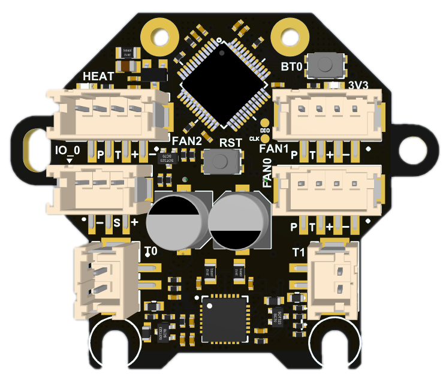
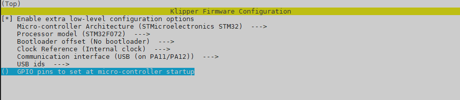

## 1. Introduction

The M36 hub board is specially designed for use with 36 circular stepper motors (Nema14) and can be used on mini Stealthburner or other print heads using 36 motors. This board can be used with a variety of motherboards, especially our catalyst and BullAnt. With special connection cables, it can also be adapted to any other system using klipper.

M36 is divided into two versions, mainly because of the difference in motor driver chips. The normal version is TMC2209, used with Catalyst motherboard; the Lite version is GC6609, used with BullAnt motherboard.

### 1.1 Feature

- Based on STM32F072
- USB interface ~~or CAN（need addon board）~~
- Onboard TMC2209 / GC6609 (Lite Version)
- 3 x 4Pin(2pin/3pin compatible) controlled Fans (default VIN power supply, 5V optional)
- 1x signal input / output interface (default 5V power supply, VIN optional , with level shift)
- 2x signal input and output interface (3.3V power supply, with 10K pull-up resistor,without level shift)
- 2X 5V single wire RGB interface (1A MAX)
- 1x 3A MAX PWM output for heating rod
- 2x ADC interface for heating temperature or other needs
- 1x onboard thermistor for board temperature or champer temperature monitor
- Comes with 250mm 4-core cable
- 24V/7A max Power Supply
- Comes with terminal housing and wire crimping tabs
- Onboard ADXL345

## 2. Hardware Guide

### 2.1 Install

5. 

### 2.2 Connectors

| Connector name | Type                     | Details                                                      |
| -------------- | ------------------------ | ------------------------------------------------------------ |
| IO_0           | PH2.0-3P                 | PB5，for input and output, with level shift,  hardware pull-up 10k resistor to 3.3v with 100R series resistor.   Use For:   Proximity switch (need 24V ) mechanical switch Photoelectric switch 24V 4pin fan (TCAH pin is suspended) |
| IO_12          | SH1.0-6P                 | 1=PB6，2=PB7, for input and output, hardware pull-up 10k resistor to 3.3v with 100R series resistor.   Use For:   mechanical switch Photoelectric switch Any digital ouput |
| MOTOR          | PH2.0-4P                 | TMC2209 / GC6609 EN : PB1 DIR : PB14 STEP : PB15 DIAG : PA8 UART : PA9 |
| INPUT          | 0.5mm 2x16 BTB connector | Max 24v 7A input, CAN_TX/USBPM=PA12, CAN_RX/USBDM=PA11       |
| T0             | PH2.0-2P                 | PA0，ADC，4.7K pull-up to 3.3V                               |
| T1             | PH2.0-2P                 | PA3，ADC，4.7K pull-up to 3.3V                               |
| TB             | no connector             | PA2，ADC，4.7K pull-up to 3.3V, onboard 100K /3950 thermistor |
| HEAT           | XH2.54-2P                | PA8，MAX 3A，PWM output，max power recommended: 24V/70W      |
| FAN0           | PH2.0-2P                 | Enable: PB11, (4pin fan = enable, 2pin/3pin fan = PWM control pin) TACH: PB12,  PWM: PB10, (only for 4pin fan) 0.5A MAX PWM，for fan control (default VIN，5V selectable) |
| FAN1           | PH2.0-4P                 | Enable: PB4, (4pin fan = enable, 2pin/3pin fan = PWM control pin) TACH: PB3,  PWM: PA15, (only for 4pin fan) 0.5A MAX PWM，for fan control (default VIN，5V selectable) |
| FAN2           | PH2.0-4P                 | Enable: PB9, (4pin fan = enable, 2pin/3pin fan = PWM control pin) TACH: PA10,  PWM: PB8, (only for 4pin fan) 0.5A MAX PWM，for fan control (default VIN，5V selectable) |
| RGB1           | SH1.0-3P                 | PB13，1A MAX sigal line RGB port, 5V，for NeoPixel, WS2812   |
| RGB2           | SH1.0-3P                 | PB0, 1A MAX sigal line RGB port, 5V，for NeoPixel, WS2812 安装R39=0-100R，可以将RGB1和RGB2串联起来，仅用PB13控制。 Install R39=0-100R, you can connect RGB1 and RGB2 in series and only use PB13 to control them. |

### 2.3 Wiring

2.3.1 With Bullant

2.3.2 With Catalyst V1

2.3.3  With Catalyst V2

2.3.4 With Other Board and Raspberry Pi
After Research on the Internet i found that boot0 and reset need be connected to 3.3v pin and GND pin.
 

### 2.4 SCH DXF STEP

Get SCH, DXF, STEP files on github:
[SCH](hardware/M36 HUB V1.1 SHC.pdf)
[DXF](hardware/M36 HUB V1.1 DXF.pdf)
[STEP](hardware/M36 HUB V1.1.pdf)

## 3. Firmware Guide

This is only Klipper firmware support. If you are Klipper beginner please check the Klipper firmware build here:  [Installation - Klipper documentation](https://www.klipper3d.org/Installation.html#installation)

### 3.1 Firmware Update

1. Turn on the power of the machine and wait for CM68 to start completely, which will take approximately 30-90s.

2. Press and hold the BT0 button on the M6 without releasing it. Press and hold the RST button for more than 2 seconds and release it. Wait for 3 seconds and release the BT0 button;

3. Enter "lsusb" in the SSH interface and you should see the DFU device appear;

4. "cd klipper" enters the klipper directory

5. "make menuconfig" configure the firmware, as shown below:

  

6. "make flash FLASH_DEVICE=0483:df11" to compile and upload;

7. When you see the word "successfully", it means the programming is successful.

1. 打开机器电源，等待CM68完全启动，大致需要30-90s。
2. 按住M6上的BT0按钮不松开，按住RST按键2秒以上松开，等待3S，松开BT0按钮；
3. 在SSH界面输入 ‘lsusb‘ 你应该能看到 DFU 设备出现；
4. ‘cd klipper ’进入klipper目录
5. ‘make menuconfig’ 进行固件配置，如下图：
6. make flash FLASH_DEVICE=0483:df11 进行编译并烧录；
7. 当看到successfully字样的时候表示烧录成功。

### 3.2 Config

 We put the Klipper configuration file in github,  you need to get the DEVICE ID by "ls /dev/serial/by-id", then replace the id in the config file.

On Catalyst and Bull Ant motherboards, the USB path is used by default for connection, and an ID is no longer required. In theory, it can be used after updating the firmware and restarting.

我们将Klipper的配置文件放在github中，需要通过“ls /dev/serial/by-id”获取DEVICE ID，然后替换配置文件中的id。

在催化剂和公牛蚁主板上，默认使用USB路径来进行连接，不再需要ID。理论上，更新完固件，重启之后既可使用。

## Buy

[Taobao](https://item.taobao.com/item.htm?spm=a1z10.3-c.w4002-23828897339.22.229c1613tHAtLW&id=690431280049)

[Aliexpress](https://www.aliexpress.com/item/1005004880078163.html)

[Official website](https://www.fysetc.com/products/fysetc-sb-can-tool-board-based-on-stm32f072-support-klipper-with-tmc2209-axl345-acceleration-sensor-for-3d-printer-parts?variant=42187842519215)

## Contacts

QQ: 1041794121

Facebook grounp：https://www.facebook.com/groups/197476557529090

Discord：https://discord.gg/Fb6FdND4

email：support@fysetc.com

